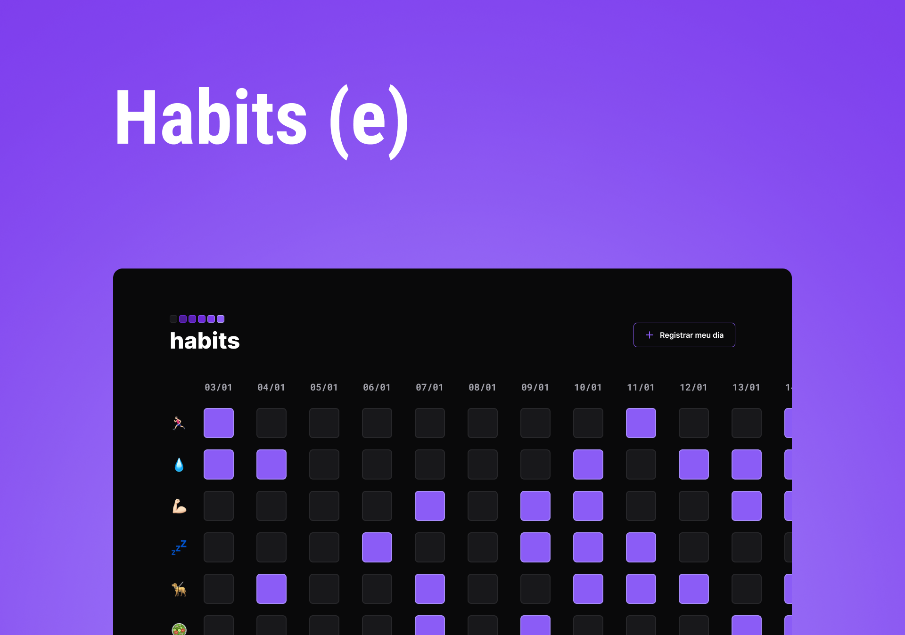

<h1 align="center"> Habits Tracker</h1>

Projetando um 'Habits Tracker' interativo no desafio <strong>#nlw</strong> 🚀

    <a href="#-tecnologias">Tecnologias</a>&nbsp;&nbsp;&nbsp;|&nbsp;&nbsp;&nbsp;
    <a href="#-projeto">Projeto</a>&nbsp;&nbsp;&nbsp;|&nbsp;&nbsp;&nbsp;
    <a href="#-layout">Layout</a>&nbsp;&nbsp;&nbsp;|&nbsp;&nbsp;&nbsp;
    <a href="#-licença">Licença</a>&nbsp;&nbsp;&nbsp;|&nbsp;&nbsp;&nbsp;
    <a href="#-contato">Contato</a>

 

  

 

  

## 🚀 Tecnologias

Esse projeto foi desenvolvido com as seguintes tecnologias:

- HTML e CSS
- JavaScript
- Git e Github
- Figma

## 💻 Projeto

Projeto de um 'Habits Tracker' interativo e responsivo para rastrear hábitos do usuário. Desafio propostos pela RocketSeat no programa NLW-Setup 🚀.

- [Visite o projeto online](https://thiagonevesalmeida.github.io/habits-tracker/)

## 🔖 Layout

Você pode visualizar o layout do projeto através [DESSE LINK](https://www.figma.com/community/file/1195327109778210238). É necessário ter conta no [Figma](https://figma.com) para acessá-lo.

## 📝 Licença

Esse projeto está sob a licença MIT.

## 📨 Contato

thiagonevesdealmeida@gmail.com

[linkedin.com/in/thiagonevesdealmeida](https://www.linkedin.com/in/thiagonevesdealmeida/) 
